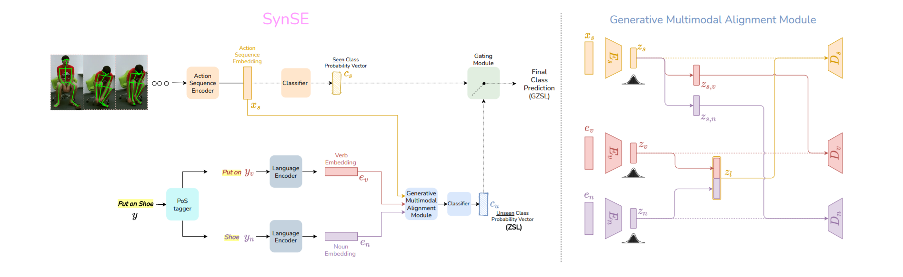

#SynSE
Original PyTorch implementation for 'Syntactically Guided Generative Embeddings For Zero Shot Skeleton Action Recognition'

## Dependencies

<ul>
  <li> Python >= 3.6 </li>
  <li> Torchvision </li>
  <li> Scikit-Learn </li>  
</ul>

## Data Preparation

### Creating the test-train splits.
The unseen classes of the various splits are listed below. These splits are also provided under the <code> ./synse_resources/resources/label_splits </code>, which can be downloaded from [here](https://drive.google.com/file/d/167xoVJQ684XU1uFhSKD6j9nAwHsnmEky/view?usp=sharing). Random unseen 5 classes can be found in the ru5.npy file. This naming scheme is used for all splits. R-random, S-seen, U-unseen, V-validation split. 

### NTU-60: 
#### Unseen Classes (55/5 split):
<table>
  <tr>
    <td align = "center"><b>A11</b> reading </td>
    <td align = "center"><b>A12</b> writing </td>
    <td align = "center"><b>A20</b> put on a hat/cap </td>
    <td align = "center"><b>A27</b> jump up </td>
    <td align = "center"><b>A57</b> touch pocket </td>
  </tr>
</table>

#### Unseen Classes (48/12 split):
<table>
  <tr>
    <td align = "center"><b>A4</b> brush hair </td>
    <td align = "center"><b>A6</b> pick up </td>
    <td align = "center"><b>A10</b> clapping </td>
    <td align = "center"><b>A13</b> tear up paper </td>
    <td align = "center"><b>A16</b> put on shoe </td>
  </tr>
  <tr>
    <td align = "center"><b>A41</b> sneeze or cough </td>
    <td align = "center"><b>A43</b> falling down </td>
    <td align = "center"><b>A48</b> nausea or vomiting </td>
    <td align = "center"><b>A52</b> pushing </td>
    <td align = "center"><b>A57</b> touch pocket </td>
  </tr>
  <tr>
    <td align = "center"><b>A59</b> walking towards </td>
    <td align = "center"><b>A60</b> walking apart </td>
  </tr>
</table>

### NTU-120: 
#### Unseen Classes (110/10 split):
<table>
  <tr>
    <td align = "center"><b>A5</b> drop </td>
    <td align = "center"><b>A14</b> put on jacket </td>
    <td align = "center"><b>A38</b> salute </td>
    <td align = "center"><b>A44</b> headache </td>
    <td align = "center"><b>A50</b> punch or slap </td>
  </tr>
  <tr>
    <td align = "center"><b>A66</b> juggle table tennis table </td>
    <td align = "center"><b>A89</b> put object into bag </td>
    <td align = "center"><b>A96</b> cross arms </td>
    <td align = "center"><b>A100</b> butt kicks </td>
    <td align = "center"><b>A107</b> wield knife </td>
  </tr>
</table>

#### Unseen Classes (96/24 split):
<table>
  <tr>
    <td align = "center"><b>A2</b> eat meal </td>
    <td align = "center"><b>A4</b> brush hair </td>
    <td align = "center"><b>A5</b> drop </td>
    <td align = "center"><b>A11</b> reading </td>
    <td align = "center"><b>A18</b> put on glasses </td>
  </tr>
  <tr>
    <td align = "center"><b>A20</b> put on a hat/cap </td>
    <td align = "center"><b>A28</b> phone call </td>
    <td align = "center"><b>A48</b> nausea/vomiting </td>
    <td align = "center"><b>A49</b> fan self </td>
    <td align = "center"><b>A54</b> point finger </td>
  </tr>
   <tr>
    <td align = "center"><b>A59</b> walking towards </td>
    <td align = "center"><b>A64</b> bounce ball </td>
    <td align = "center"><b>A67</b> hush </td>
    <td align = "center"><b>A80</b> squat down </td>
    <td align = "center"><b>A84</b> play magic cube </td>
  </tr>
   <tr>
    <td align = "center"><b>A87</b> put on bag </td>
    <td align = "center"><b>A90</b> take object out of bag </td>
    <td align = "center"><b>A93</b> shake fist </td>
    <td align = "center"><b>A98</b> arm swings </td>
    <td align = "center"><b>A99</b> run on the spot </td>
  </tr>
  <tr>
    <td align = "center"><b>A101</b> cross toe touch </td>
    <td align = "center"><b>A104</b> stretch oneself </td>
    <td align = "center"><b>A106</b> hit with object </td>
    <td align = "center"><b>A109</b> grab stuff </td>
  </tr>
</table>

### Visual Feature Generation:

  We provide the visual features generated via SHIFT-GCN for the NTU-120 and NTU-60 dataset for the various splits. They can be found under the <code> ./synse_resources/ntu_results </code> repository, which is downloadable from [here](https://drive.google.com/file/d/167xoVJQ684XU1uFhSKD6j9nAwHsnmEky/view?usp=sharing). train.npy contains the visual features of the training data from the seen classes. ztest.npy contains the test data from the unseen classes. gtest.npy contains the test data from all the classes. 

  If you wish to generate the visual features yourself:
  1. Download the NTU-60 and NTU-120 datasets by requesting them from <a href="http://rose1.ntu.edu.sg/Datasets/actionRecognition.asp">here</a>.
  2. Create the test-train-val splits for the datasets using the split file created in the previous steps.
  3. Train the visual feature generator. Follow [this](https://github.com/kchengiva/Shift-GCN) for training Shift-GCN. For each split a new feature generator has to be trained following the zero shot learning assumption. The trained Shift-GCN weights can be found under the repository. <code> ./synse_resources/ntu_results/shift_5_r/weights/ </code>
  4. Save the features for train data, unseen test data(zsl) and the entire test data(gzsl). 
  

 
### Text feature generators
  We provide the generated language features as well, for the labels in NTU60, and NTU120 dataset. They can be found in <code> ./synse_resources/resources/ </code>

  If you wish to generate the language features yourself.
    1. Word2Vec: Download the <a href="https://drive.google.com/file/d/0B7XkCwpI5KDYNlNUTTlSS21pQmM/edit">Pre-Trained Word2Vec Vectors</a> and extract the contents of the archive </li>
    2. For Sentence-BERT, we use the sentence-transformers package from [here](https://github.com/UKPLab/sentence-transformers). We use the stsb-bert-large model.

  
## Experiments
We provide the scripts necessary to obtain the results shown in the paper. They include training and evaluation scripts for ReViSE \[1\], JPoSE\[2\], CADA-VAE\[3\] and our model SynSE.
The scripts for each of the three models are present in their respective folders (jpose, revise, synse). 
 
A README is present in each folder detailing the use of the provided scripts for both training and evaluation.

### Upcoming
- arxiv link

## References:
<ol>
<li>Hubert Tsai, Yao-Hung, Liang-Kang Huang, and Ruslan Salakhutdinov. "Learning robust visual-semantic embeddings." In Proceedings of the IEEE International Conference on Computer Vision, pp. 3571-3580. 2017. </li>
 
<li>Wray, Michael, Diane Larlus, Gabriela Csurka, and Dima Damen. "Fine-grained action retrieval through multiple parts-of-speech embeddings." In Proceedings of the IEEE International Conference on Computer Vision, pp. 450-459. 2019.</li>
 
<li>Schonfeld, Edgar, Sayna Ebrahimi, Samarth Sinha, Trevor Darrell, and Zeynep Akata. "Generalized zero-and few-shot learning via aligned variational autoencoders." In Proceedings of the IEEE Conference on Computer Vision and Pattern Recognition, pp. 8247-8255. 2019.</li>
